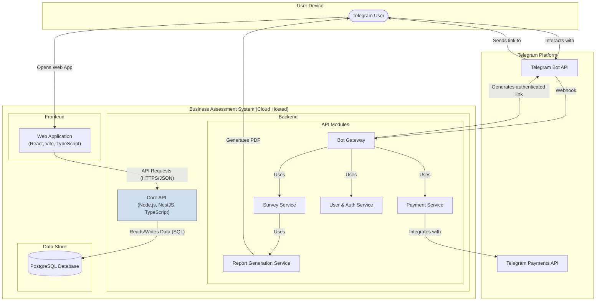
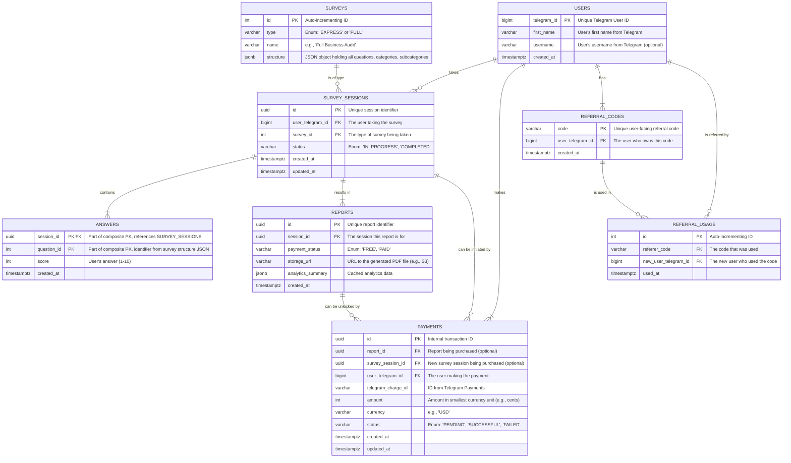
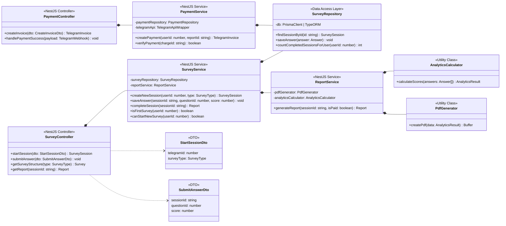

#  Technical Specification
## [TRD-1] Introduction & Vision
This Technical Requirements Document (TRD) provides a detailed architectural and implementation blueprint for the Business Self-Assessment Tool. The system is comprised of a Telegram bot acting as the primary user interface and a web application for conducting the surveys.

The technical vision is to build a scalable, maintainable, and secure application using a modern TypeScript-based stack. The architecture will be modular, separating the concerns of the Telegram bot interaction, the core business logic via an API, and the user-facing survey web application. This separation ensures that each component can be developed, tested, and deployed independently, following the Risk-First Implementation Philosophy. User authentication and session management will be tightly integrated with Telegram's ecosystem to provide a seamless user experience.

## [TRD-2] System Overview
The solution is a composite system consisting of three primary components:

This system will function as a standalone service, with its primary external dependencies being the Telegram Bot API and Telegram Payments API.

[TRD-3] Telegram Bot: The main entry point for users. It handles commands for starting surveys, viewing history, managing referrals, and accessing help. It initiates the survey process by providing the user with a unique, authenticated link to the web application. 

[TRD-4] Web Application (Survey UI): A Single Page Application (SPA) responsible for presenting the survey questions, capturing user responses, displaying progress, and handling the auto-save functionality. It communicates with the Core API. 

[TRD-5] Core API (Backend): The central nervous system of the application. It manages business logic, user data, survey content, session state, payment processing, and report generation. It exposes a RESTful API for the Web Application and communicates with the Telegram Bot API. 

## [TRD-6] Architectural Drivers
### [TRD-7] Goals
[TRD-8] Maintainability: The codebase will be strictly typed using TypeScript and structured into logical modules. The Don't Repeat Yourself (DRY) principle will be enforced through shared data models and reusable components. 

[TRD-9] Testability: Each component (API, Web App, Bot handler) will be designed to be testable in isolation. The API will follow a repository pattern to abstract data access, allowing for easier unit and integration testing. 

[TRD-10] Rapid MVP Development: The technology stack and modular architecture are chosen to accelerate the development and deployment of the Minimum Viable Product (MVP). 

[TRD-11] User Experience: The system must provide a seamless and responsive experience, with minimal latency during question transitions and reliable progress saving. 

### [TRD-12] Constraints
[TRD-13] Primary Interface: The user journey must originate and be manageable from the Telegram bot. 

[TRD-14] Authentication: User identity is exclusively tied to their Telegram ID. No traditional email/password authentication will be implemented. 

[TRD-15] Technology Stack: The implementation must use the following technologies: 

[TRD-16] Frontend: React with Vite 

[TRD-17] Backend: Node.js with a TypeScript framework 

[TRD-18] Database: PostgreSQL 

[TRD-19] Language: TypeScript across the entire stack. 

[TRD-20] Payment Gateway: All financial transactions must be processed through Telegram Payments. 

[TRD-21] Initial Scale: The system must be designed to handle approximately 50 daily active users for the MVP launch. 

## [TRD-22] High-Level Architecture
The system will be implemented using a modular, three-tier architecture. A monolithic backend (modular monolith) is chosen for the Core API to simplify development and deployment for the MVP scope, while maintaining clear internal boundaries between services.

TODO: Confirm the choice of NestJS as the backend framework. The user mentioned "Nuxt" and "node". Since Nuxt is a Vue framework and React was specified for the frontend, NestJS is proposed as the best-in-class choice for a structured, TypeScript-first Node.js backend.

Options: 1. 

Proceed with NestJS

 (Pro: Excellent structure, dependency injection, and TypeScript support, ideal for AI coders. Con: Steeper learning curve than Express). 2. 

Use Express.js with TypeScript

 (Pro: Simpler, widely used. Con: Less structured, requires more boilerplate for a robust setup). 3. 

Use a different Node.js framework.

[TRD-23] Web Application (React SPA): A client-side application built with React and Vite. It will fetch survey data from and submit answers to the Core API. It receives a short-lived authentication token from the Telegram bot link to identify the user. 

[TRD-24] Core API (Node.js/NestJS): A backend service built with NestJS, providing a structured and scalable foundation. Its responsibilities include: 

[TRD-25] Serving the survey questions and structure. 

[TRD-26] Authenticating users based on data from Telegram. 

[TRD-27] Persisting user answers in real-time. 

[TRD-28] Calculating analytics and generating PDF reports. 

[TRD-29] Interfacing with the Telegram Payments API. 

[TRD-30] Managing user history and survey retakes. 

[TRD-31] Telegram Bot Gateway: A module within the Core API that listens for and responds to webhooks from the Telegram Bot API. It handles user commands and orchestrates the user flow. 

[TRD-32] PostgreSQL Database: A relational database for persistent storage of all application data, including users, surveys, answers, and payment records. 

### [TRD-33] Components Diagram
[TRD-34]


## [TRD-35] Data Architecture and Models
A relational data model using PostgreSQL is selected to ensure data integrity, especially for user relationships, survey sessions, and financial transactions. All 

created_at

 and 

updated_at

 fields will be of type 

TIMESTAMPTZ

 to handle timezones correctly.

### [TRD-36] Entity Relationship Diagram (ERD)
[TRD-37]


### [TRD-38] Core Data Models (TypeScript Interfaces)
These models define the data structures for API communication and will be shared between the backend and frontend to ensure type safety (DRY principle).

[TRD-39]
```typescript
// /models/shared.ts

export interface User {
  telegramId: number;
  firstName: string;
  username?: string;
}

export enum SurveyType {
  EXPRESS = 'EXPRESS',
  FULL = 'FULL',
}

export enum SessionStatus {
  IN_PROGRESS = 'IN_PROGRESS',
  COMPLETED = 'COMPLETED',
}

export enum PaymentStatus {
  FREE = 'FREE',
  PAID = 'PAID',
}

// Represents a single question within the survey structure
export interface SurveyQuestion {
  id: number;
  text: string;
}

// Represents a subcategory containing questions
export interface SurveySubcategory {
  id: string;
  name: string;
  questions: SurveyQuestion[];
}

// Represents a main category containing subcategories
export interface SurveyCategory {
  id: string;
  name: string;
  subcategories: SurveySubcategory[];
}

// The full structure of a survey
export interface Survey {
  id: number;
  type: SurveyType;
  name: string;
  structure: SurveyCategory[];
}

// Data required to start a new survey session
export interface StartSessionDto {
  telegramId: number;
  surveyType: SurveyType;
}

// Data for submitting a single answer
export interface SubmitAnswerDto {
  sessionId: string; // UUID
  questionId: number;
  score: number; // Must be an integer $1 \le score \le 10$
}

// Data model for a user's survey session
export interface SurveySession {
  id: string; // UUID
  userId: number;
  surveyType: SurveyType;
  status: SessionStatus;
  answers: Record<number, number>; // { questionId: score }
  createdAt: string; // ISO 8601 Date
}
```

## [TRD-40] Component Blueprint & Class Diagram
This diagram outlines the primary classes and services within the Core API backend, demonstrating their relationships and key responsibilities. It focuses on the NestJS service-oriented architecture.

### [TRD-41] Class Diagram
[TRD-42]


## [TRD-43] User Interface / User Experience Key Requirements
The UI must be clean, modern, and mobile-first, ensuring a smooth experience for users on Telegram.

### [TRD-44] General Look & Feel
[TRD-45] Style: Clean and minimalist design, with clear typography and intuitive controls. 

[TRD-46] Branding: Use a professional color palette. 

[TRD-47] TODO: Provide the brand's primary and secondary color codes. 

[TRD-48] Flow: The transition from the Telegram bot to the web app must be seamless. The web app should load instantly with a loading indicator if necessary. 

### [TRD-49] Key Screens / Views
#### [TRD-50] Survey View
[TRD-51] Layout: One question per page. 

[TRD-52] Header: The header will persistently display the current category and subcategory names. 

[TRD-53] Progress Indicators: Two progress bars must be visible at all times: 

[TRD-54] Overall Progress Bar: Shows completion percentage across all categories ($Progress_{overall} = \frac{\text{Completed Categories}}{\text{Total Categories}}$). 

[TRD-55] Category Progress Bar: Shows completion percentage of questions within the current category ($Progress_{category} = \frac{\text{Answered Questions in Category}}{\text{Total Questions in Category}}$). 

[TRD-56] Question Area: Displays the text of the current question. 

[TRD-57] Answer Input: A row or grid of 10 selectable buttons/icons, labeled 1 to 10. Once an answer is selected, the app automatically submits it and transitions to the next question. 

[TRD-58] Navigation: No "back" button is permitted. A "next" button is also not required, as selection triggers the next step. 

#### [TRD-59] Survey Completion / Report View
[TRD-60] On Completion: After the last question, the user is shown a confirmation screen. 

[TRD-61] Buttons: 

[TRD-62] "Get Free Report": Immediately triggers the download of the free PDF report. 

[TRD-63] "Buy Full Version": Initiates the payment flow via the Telegram bot. 

[TRD-64] Report Display: The web app will show a summary of the free report on-screen, with sections for paid content clearly marked as locked or blurred, encouraging the upgrade. 

### [TRD-65] Data models
[TRD-66] The frontend will use the shared TypeScript interfaces defined in the Data Architecture and Models section for all API interactions and state management, ensuring consistency. 

[TRD-67] A local state management library (e.g., Zustand or Redux Toolkit) will be used to manage the survey session state, including the list of questions, the user's answers, and current progress. 

### [TRD-68] Data Presentation
[TRD-69] Dates: All timestamps will be displayed in the user's local time format. 

[TRD-70] Percentages: Analytics scores will be displayed as percentages rounded to the nearest whole number (e.g., 73%). 

[TRD-71] Charts: Pie charts in the PDF report must be clearly labeled with the category/subcategory name and its corresponding percentage score. 

### [TRD-72] Key Interaction Patterns
[TRD-73] Auto-Save: After the user selects a score for a question, the UI will show a subtle loading/saving indicator (e.g., a spinner for <1s). The answer button selection should be disabled during this submission to prevent double-clicks. 

[TRD-74] Error Handling: If an answer fails to save (e.g., due to network issues), a passive, non-blocking toast notification will appear at the top or bottom of the screen (e.g., "Connection error. Could not save answer. Please check your connection and try again."). The app should automatically retry the submission once the connection is restored. 

[TRD-75] Session Resume: When a user re-opens an in-progress survey link, the application will fetch the session state from the API and navigate the user directly to the first unanswered question. 

### [TRD-76] Styling plan
[TRD-77] Framework: Tailwind CSS will be used for utility-first styling. This allows for rapid development and easy maintenance of a consistent design system. 

[TRD-78] Configuration: A tailwind.config.js file will define the project's design tokens, including the color palette, font sizes, and spacing units. 

[TRD-79] Key UI Style Classes: 

[TRD-80] .progress-bar-container: The container for the progress bars. 

[TRD-81] .progress-bar-fill: The colored fill of the progress bar, whose width is dynamically set. 

[TRD-82] .question-text: The style for the main question text. 

[TRD-83] .answer-button: The default state for an answer button. 

[TRD-84] .answer-button-selected: The style for a selected answer button. 

[TRD-85] .btn-primary: Primary call-to-action button style (e.g., "Buy Full Version"). 

[TRD-86] .btn-secondary: Secondary action button style (e.g., "Get Free Report"). 

### [TRD-87] UI Implementation Plan
[TRD-88] Reusable Components: 

[TRD-89] ProgressBar(value: number, total: number): A component that renders a single progress bar. Used for both overall and category progress. 

[TRD-90] QuestionCard(question: SurveyQuestion, onAnswer: (score: number) =&gt; void): Displays a question and the 1-10 answer buttons. Manages the selection and submission state. 

[TRD-91] SurveyHeader(categoryName: string, subcategoryName: string): Displays the current context of the survey. 

[TRD-92] ToastNotification(message: string, type: 'error' | 'success'): A component for displaying passive notifications. 

[TRD-93] ReportSummary(analytics: AnalyticsResult): Displays the on-screen summary of the report with locked sections. 

## [TRD-94] Mathematical Specifications and Formulas
The calculation of analytics is a core feature and must be implemented with precision.

### [TRD-95] Analytics Calculation Formula
The formula converts a raw score average on a 1-10 scale to a percentage from 0% to 100%.

[TRD-96] Let $R_i$ be the score for question $i$, where $R_i \in {1, 2, ..., 10}$. 

[TRD-97] Let $n$ be the total number of questions in the given scope (category or subcategory). 

[TRD-98] The average score, $\bar{R}$, is calculated as: 

[TRD-99]
```latex
\bar{R} = \frac{\sum_{i=1}^{n} R_i}{n}
```

[TRD-100] The final percentage score, $P$, is calculated as: 

[TRD-101]
```latex
P = \frac{\bar{R} - 1}{9} \times 100\%
```

[TRD-102] Constraint: The input score for any question must be an integer where $1 \le R_i \le 10$. The system must validate this on input. 

### [TRD-103] Implementation Considerations
[TRD-104] Data Types: All calculations involving scores and averages must use floating-point numbers (float64 or Decimal type for higher precision) to avoid rounding errors before the final presentation. 

[TRD-105] Edge Cases: The calculation must handle cases where $n=0$ (e.g., a category with no questions) gracefully, returning 0% without a division-by-zero error. 

[TRD-106] Validation: The backend service responsible for analytics calculation must re-validate all incoming answer scores to ensure they are within the [1, 10] range. 

## [TRD-107] DEVOPS Requirements
### [TRD-108] Deployment
[TRD-109] Containerization: The Core API and the Web Application will be containerized using Docker for consistency across development, staging, and production environments. 

[TRD-110] Frontend Hosting: The React/Vite web app will be deployed as a static site on a platform like Vercel or AWS S3/CloudFront for optimal performance and scalability. 

[TRD-111] Backend Hosting: The containerized NestJS application will be deployed on a Platform-as-a-Service (PaaS) like Render, Heroku, or AWS Fargate to simplify infrastructure management. 

[TRD-112] Database: A managed PostgreSQL service (e.g., Amazon RDS, Google Cloud SQL, or a provider on Render/Heroku) will be used to handle backups, scaling, and maintenance. 

[TRD-113] CI/CD: A simple CI/CD pipeline will be set up using GitHub Actions. Pushes to the main branch will trigger automated tests, builds, and deployments to a staging environment. Manual promotion to production will be required. 

### [TRD-114] Configuration
[TRD-115] Environment Variables: All configuration, including database connection strings, Telegram API tokens, and secret keys, will be managed through environment variables. A .env.example file will be maintained in the repository. 

[TRD-116] Infrastructure as Code (IaC): 

[TRD-117] TODO: Decide on the necessity of IaC for the MVP. Options: 1. Manual Setup: Manually configure resources on the chosen cloud provider for the MVP to save time. (Pro: Fast. Con: Not repeatable). 2. Basic IaC: Use a simple tool like Terraform or the serverless framework to define the core infrastructure. (Pro: Repeatable, scalable. Con: Initial setup overhead). 

### [TRD-118] Monitoring
[TRD-119] Logging: The Core API will implement structured logging (JSON format). Logs will be sent to a log aggregation service (e.g., Datadog, Logtail, or the PaaS provider's built-in solution). 

[TRD-120] Health Checks: The API will expose a /health endpoint that checks the database connection and returns a 200 OK status. This will be used by the hosting platform for automated health monitoring. 

[TRD-121] Error Tracking: An error tracking service like Sentry or Bugsnag will be integrated into both the frontend and backend to capture and alert on unhandled exceptions. 

## [TRD-122] Implementation, Validation and Verification Strategy
### [TRD-123] Overall Approach
The project will follow a Risk-First Implementation strategy, focusing on tackling the most complex and uncertain components first.

[TRD-124] Isolate and De-risk Core Integrations: Build and test integrations with external services (Telegram API, Telegram Payments, PDF Generation library) as standalone proofs-of-concept. 

[TRD-125] Vertical Slicing: Implement features end-to-end in vertical slices. For example, the first slice would be: "A user can start an express survey from Telegram, answer one question, have it saved, and see the session in the database." 

[TRD-126] Automated Testing: 

[TRD-127] Unit Tests: All services, utility functions, and complex components (especially AnalyticsCalculator) will have comprehensive unit tests. 

[TRD-128] Integration Tests: Tests will cover the API endpoints, ensuring they correctly interact with the database and other services. 

[TRD-129] End-to-End (E2E) Tests: A small suite of E2E tests using a framework like Cypress or Playwright will verify the critical user flow from starting the survey in Telegram to completing it in the web app. 

### [TRD-130] Integration Risk Mitigation
[TRD-131] Telegram Bot & Auth API: 

[TRD-132] Risk: The mechanism for securely authenticating a user from a Telegram link to a web app session can be complex. 

[TRD-133] Mitigation: Develop a dedicated AuthService early. The flow will be: 

[TRD-134] User clicks button in Telegram. 

[TRD-135] Bot Gateway generates a short-lived (e.g., 60 seconds) JSON Web Token (JWT) containing the telegram_id. 

[TRD-136] The user is redirected to https://webapp.com/survey/start?token=&lt;JWT&gt;. 

[TRD-137] The web app sends this JWT to the API, which validates it and creates a survey session, returning a session-specific token for subsequent API calls. 

[TRD-138] Telegram Payments API: 

[TRD-139] Risk: The payment webhook and verification flow must be robust to prevent fraud or missed payments. 

[TRD-140] Mitigation: Create a dedicated PaymentService and test it against Telegram's test environment. Implement idempotent webhook handling to safely process duplicate notifications from Telegram. 

[TRD-141] PDF Generation Library (e.g., pdf-lib or Puppeteer): 

[TRD-142] Risk: Generating visually appealing PDFs with charts on the server can be resource-intensive and complex. 

[TRD-143] Mitigation: 

[TRD-144] Create a ReportService that abstracts the PDF generation logic. 

[TRD-145] Initially, build a simple PDF with text-only analytics to validate the data flow. 

[TRD-146] In a parallel task, investigate and prototype the charting component. Using a serverless function for Puppeteer (headless Chrome) is a robust option for converting an HTML template to a high-quality PDF. 

[TRD-147] State Management in React: 

[TRD-148] Risk: Losing user progress due to bugs in state management or the auto-save mechanism would lead to a very poor user experience. 

[TRD-149] Mitigation: Use a well-established state management library like Zustand. The "auto-save" will be implemented as an API call in a useEffect hook that triggers whenever the local answers state changes. Implement a simple retry mechanism for failed API calls. 
